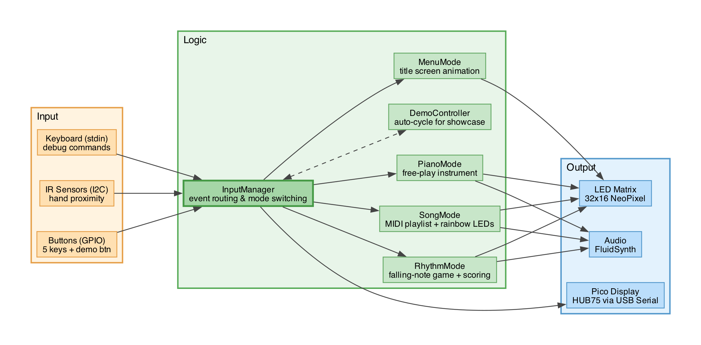

# Pi-ano

An interactive piano and rhythm game built on Raspberry Pi. Five keys, a 32x16 LED matrix, IR gesture sensors, and a Pico-driven HUB75 display come together for a playable musical experience with multiple game modes.

## Modes

### Menu
Animated "Pi-ANO" title screen with a shimmering rainbow gradient across the five key zones.

### Piano
Free-play mode. Press physical buttons or wave your hand over the IR sensors to trigger notes (C4, D4, E4, F4, G4) with real-time audio synthesis via FluidSynth. LED brightness follows velocity. Supports multiple SoundFonts (piano, guitar, etc.) — long-press KEY_1 to cycle.

### Rhythm
A falling-note rhythm game with three difficulty levels:

| Difficulty | Song |
|------------|------|
| Easy | Twinkle Twinkle Little Star |
| Medium | The Pink Panther |
| Hard | Can't Help Falling In Love |

Timing windows: PERFECT (80ms), GOOD (160ms), MISS (250ms+). High scores are saved per difficulty. Post-game displays your score and personal best on the Pico screen.

### Song
Plays MIDI files from a built-in playlist with a full-panel rainbow gradient animation. Press KEY_3 to skip tracks.

### Demo
Boots into demo mode by default. Auto-cycles: Piano (15s) → Rhythm (select difficulty or auto-skip after 15s) → Song (random track) → loop. Long-press the red button (D19) to exit demo and enter normal mode. Long-press KEY_4 to manually skip phases.

## Hardware

```
Raspberry Pi 4
├── 32x16 WS2812B NeoPixel Matrix (GPIO D18)
├── 5x Physical Buttons (GPIO D25, D24, D23, D15, D14)
├── 5x VL53L0X IR Time-of-Flight Sensors (I2C)
├── FluidSynth Audio (ALSA, 44.1kHz)
└── USB Serial ↔ Raspberry Pi Pico 2
                  └── 32x16 HUB75 RGB LED Matrix
                       (mode display, countdown, scores)
```

## Project Structure

```
src/
├── app/main.py                  # Entry point & main loop
├── hardware/
│   ├── audio/audio_engine.py    # FluidSynth wrapper
│   ├── config/keys.py           # Key layout, zones & palettes
│   ├── input/                   # Button, IR, keyboard polling
│   ├── led/led_matrix.py        # NeoPixel matrix abstraction
│   └── pico/pico_mode_display.py  # Pi ↔ Pico serial protocol
├── logic/
│   ├── input_manager.py         # Event routing & mode switching
│   ├── demo_controller.py       # Demo mode state machine
│   ├── rhythm_postgame.py       # Post-game score display
│   └── modes/                   # Menu, Piano, Rhythm, Song
└── pico/
    ├── code.py                  # Pico firmware (CircuitPython)
    └── graphics/                # BMP assets for HUB75 display
```

## Architecture



## Setup

### Pi

```bash
# Clone
git clone https://github.com/little-xiaohe/pi-ano.git
cd pi-ano

# Install dependencies
python3 -m venv .venv
source .venv/bin/activate
pip install -r requirement.txt

# Add audio assets (not included in repo)
# SoundFont files (.sf2) go in:
#   src/hardware/audio/assets/sf2/
# MIDI files for rhythm mode go in:
#   src/hardware/audio/assets/midi/rhythm/
# MIDI files for song mode go in:
#   src/hardware/audio/assets/midi/song/

# Run (requires root for GPIO/NeoPixel)
sudo .venv/bin/python3 -m src.app.main
```

### Pico

Copy `src/pico/code.py`, `src/pico/fonts/`, and `src/pico/graphics/` to the Pico 2 running CircuitPython. It communicates with the Pi over USB serial at 115200 baud.

## Key Layout (left to right)

| Key | GPIO | Note | Piano | Rhythm (select) | Rhythm (play) | Long Press |
|-----|------|------|-------|-----------------|---------------|------------|
| KEY_0 | D25 | C4 | Play note | — | Hit | Quit / Shutdown |
| KEY_1 | D24 | D4 | Play note | HARD | Hit | Cycle SoundFont |
| KEY_2 | D23 | E4 | Play note | MEDIUM | Hit | — |
| KEY_3 | D15 | F4 | Play note | EASY | Hit | — |
| KEY_4 | D14 | G4 | Play note | — | Hit | Cycle Mode |
| **Red Button** | **D19** | — | — | — | — | **Toggle Demo** |

## Controls

| Input | Action |
|-------|--------|
| KEY_0 – KEY_4 | Play notes (piano) / Hit lanes (rhythm) |
| Long-press KEY_0 / leftmost blue key (D25) | Shutdown / quit |
| Long-press KEY_4 / rightmost blue key (D14) | Cycle modes |
| Long-press KEY_1 (D24) | Cycle SoundFonts |
| Long-press red button (D19) | Toggle demo mode |
| IR sensors | Gesture-based note triggers (piano mode) |
| Keyboard `mode <name>` | Switch mode via terminal |
| Keyboard `on <key> [vel]` | Debug note trigger |

## Dependencies

- **adafruit-circuitpython-neopixel** — LED matrix control
- **adafruit-circuitpython-vl53l0x** — IR distance sensors
- **pyfluidsynth** — Real-time MIDI audio synthesis
- **mido** — MIDI file parsing
- **pyserial** — USB serial communication with Pico

## Contributors

- [ASHLEY HUANG](https://github.com/little-xiaohe)
- [YI-CHIA WU](https://github.com/23dude)
